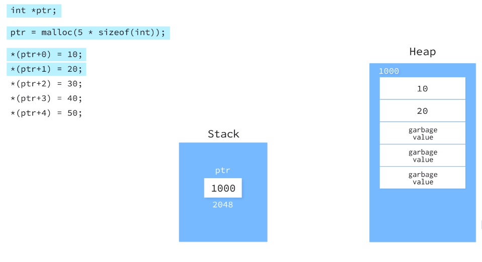
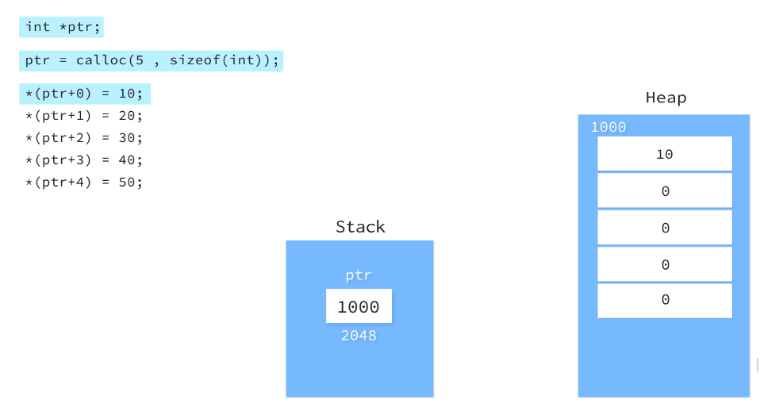
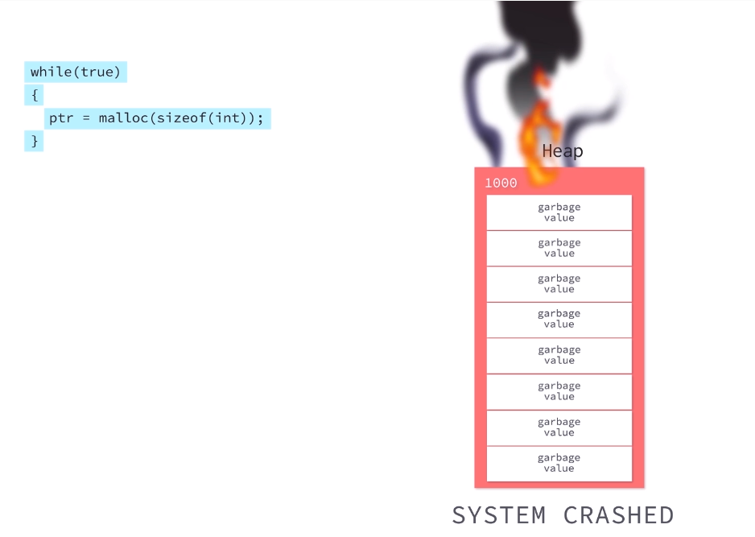
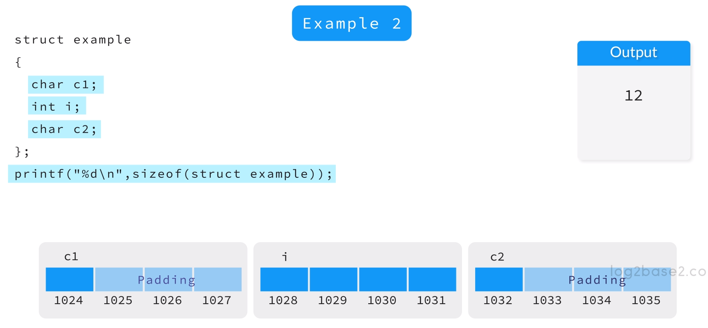
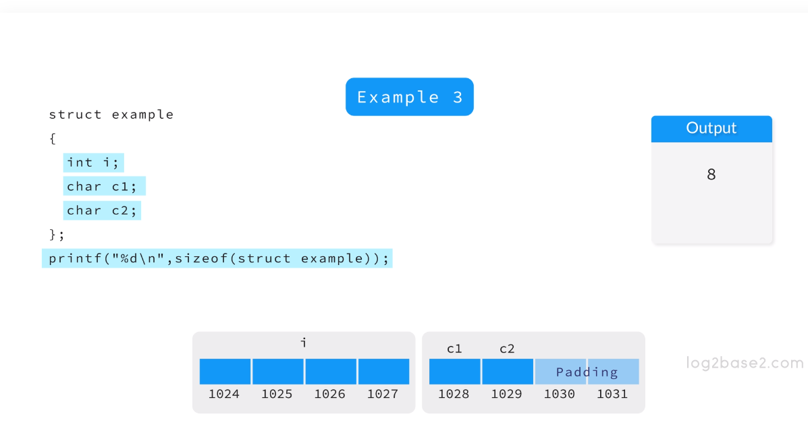

# Storage classes

The objective of the storage classes is to define the scope and lifetime of the variables.

The **default storage class for all local variables** is *auto*. Example:

```c 
int main() {
    auto int a;
    a = 100;
    return 0;
}
```

So, as the *auto* is default, you can omit it:

```c 
int main() {
    int a;
    a = 100;
    return 0;
}
```

Now, about the **scope**, the *a* variable is available just in the function context, you can not access it from another function.

If you want **to extend the scope of a variable** throughout the programming, you can use *static* storage class. Example:

```c 
#include<stdio.h>

int fun()
{
  static int count = 10;
  count++;
  return count;
}
  
int main()
{
  printf("%d ", fun());
  printf("%d ", fun());
  printf("%d ", fun());
  return 0;
}
```

To store the variable in the processor (in a context where you need to access a variable frequently and you you need it be faster) you can use the storage class register. Example:

```c 
#include<stdio.h>

int main()
{
  register int i;
  i = 10; 
  printf("%d ", i);
  // it will fail, "i" do not has a address in RAM.
  // error: address of register variable ‘i’ requested
  printf("Endereço na memória: %u", &i); 
  return 0;
}
```

You can use extern storage variable, in other words, you can use variables from other files (modules). Please, compile the *file1.c* e *file2.c*:

```c 
// file1.c
#include<stdio.h>

extern int i;

int main(){
    printf("i = %d\n", i);
    return 0;
}
```

-------------------

```c 
// file2.c
int i=10;
```

------------------------
```bash
~user$ gcc file1.c file2.c
```

## Summary

- **auto**: default storage class and variable scope within function.
- **static**: extends the local variable scope throughout the program.
- **register**: stores  in processor register and provides fast access.
- **extern**: extend the visibility across different files.  

# Pointers

You can reserve a memory address for a variable using a pointer. Syntax example:

```c
int *a; 
```

## Application of pointers

The main application for pointers is embedded systems/device, where exist a concern about low memory use.

For example, image a device that control temperature:


There is a sensor attached to a memory address (1024) that will storage a temperature value. 

A program will access (point to 1024) this particular memory address to make decisions.

Pointers also help with memory efficiency allocation. For example, when we need to pass some data to a function, instead to pass a data that will consume new memory space inside the function, we can just pass to the function a pointer to the memory address where data is storage, in this way, the function will be able to work with the data without use memory space unnecessarily.

Please, see the code in *pointer_intro.c* and compile it to see his output.

## Memory Allocation (malloc, calloc and realloc)

You can allocate memory in two storage classes:

- **Static**: will use the stack memory section of the RAM.
- **Dynamic**: will use the heap memory section of the RAM.

The *c* functions to allocate memory are: ```malloc and calloc```.

These function are in ```stdlib.h``` library.

## malloc

The *malloc()* allocates a memory block of given size (in bytes) and returns a pointer to the beginning of the block. The *malloc()* doesn’t initialize the allocated memory. If you try to read from the allocated memory without first initializing it, then you will invoke undefined behavior, which will usually mean the values you read will be garbage.



If the memory required is not available in the heap, *malloc* will return *NULL*.

## calloc

The *calloc()* allocates the memory and also initializes every byte in the allocated memory to 0. If you try to read the value of the allocated memory without initializing it, you’ll get 0 as it has already been initialized to 0 by *calloc()*.



## realloc

If the memory allocated was not enough, you can reallocate more using *realloc*. If the memory area is not created dynamically using *malloc* and *calloc*, then the behavior of the *realloc* function is *unmodified*.


It's also possible to *realloc* memory to be less then the original allocation.

## Memory leak and free() function

If we allocate more memory them is available, the system will crash, this is called *memory leak*:




What can we do?

If a the heap memory is full (memory leak) we know that the *malloc*, *calloc* and *realloc* will return *NULL*.
If the case, you can *clean* a section of memory using *free()* function passing the pointer as argument:


# Structure Padding and Packing



How you can see in the image above, the char *c1* occupies 1 byte of memory, but 4 bytes is reserved for it, it lefts 3 bytes off. The integer *i* occupies 4 bytes, so it can't use the 3 bytes left by the *c1* char. So, the system adds a 3 bytes padding after *c1* to reserve 4 bytes for the integer *i*.

In this way, 12 bytes of memory was needed for the Structure *example*.

But if we reorganize the order of the variable to "char, char, int" we'll have another allocation memory result. Ex:



To avoid the structure padding behavior, we can packed it.  


The padding helps **increases system performance**. Why? A system of 32 bytes could read 32 bytes at time (the 4 blocks of memory in images above), so it is fast to it reserve 32 bytes for each variable, so the processor could jump every 32 bytes and just read the value of each variable:


when we packed the structure, the values of each variable overlaps the "windows" of 32 bytes and the processor needs more work to deal with overlapping and finally reads the values of each variable:


This will reduce the system performance, but we has **memory efficiency**.

Please, check the *structure.c* file.

